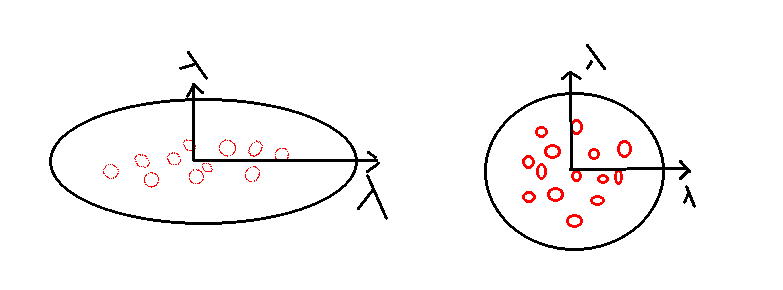
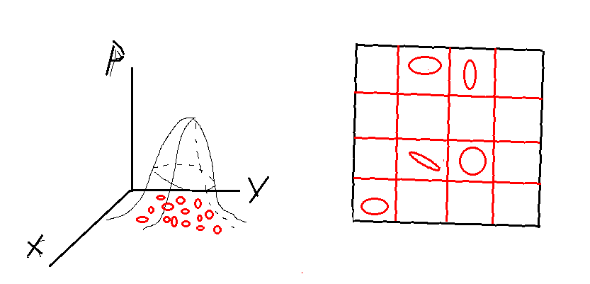

# NDT

[Step](https://blog.csdn.net/AdamShan/article/details/79230612):
1. 网格化
2. 计算每个网格的 PDF
3. 最大似然导出代价函数
4. 用牛顿法优化 $T$

开源算法：
- PCL

思路：
- Coarse to Fine
- Grid = Cell
- ICP 的方案 [[LOAM]]
- particle filter localization

> [Instead of trying to match points from our current scan to point on the map, we try to match points from our current scan to a **grid** of probability functions created from the map.](https://medium.com/self-driving-cars/ndt-matching-acff8e7e01cb)

- [NDT原理推导](http://xchu.net/2019/09/14/NDT原理推导/)
  - 优化技巧：
    - 八叉树
    - 多线程
      - OpenMP
      - SSE
      - [ndt_omp](https://github.com/koide3/ndt_omp)
      - [hdl_localization](https://github.com/koide3/hdl_localization)
    - CUDA
- [Autoware](https://www.autoware.ai)

[//begin]: # "Autogenerated link references for markdown compatibility"
[LOAM]: LOAM "LOAM"
[//end]: # "Autogenerated link references"
