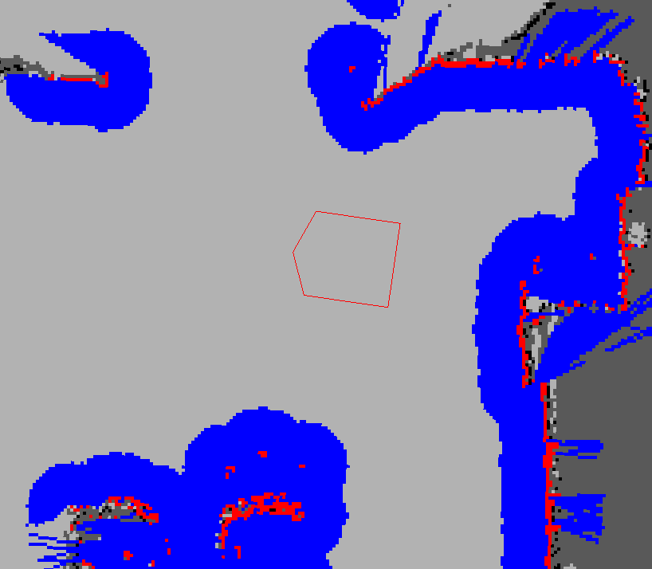

# Costmap 2d

> This package provides an implementation of a 2D costmap that takes in sensor data from the world, builds a **2D or 3D occupancy grid** of the data (depending on whether a voxel based implementation is used), and **inflates costs** in a 2D costmap based on the occupancy grid and a user specified inflation radius. This package also provides support for `map_server` based initialization of a costmap, **rolling window** based costmaps, and parameter based subscription to and configuration of sensor topics.

图中：
- 红色表示障碍物
- 蓝色表示膨胀区域
- 红色多边形表示机器人轮廓

地图分层
- Static Map Layer
- Obstacle Map Layer
  - 维护三维空间的障碍物信息 `voxel_grid`
  - **标记 Marking**障碍物
  - **清除 Clearing**障碍物
    - raytracing 算法
  - > If a **3D** structure is used to store obstacle information, obstacle information from each column is **projected** down into **2D** when put into the **costmap**.
- Inflation Layer
- Other Layers
  - Social Costmap Layer
  - Range Sensor Layer

Cell 的状态
- FREE_SPACE
- NO_INFORMATION
- LETHAL_OBSTACLE

TF
- All transforms between the coordinate frames specified by the `global_frame` parameter, the `robot_base_frame` parameter, and sensor sources are **connected and up-to-date**.
- `transform_tolerance`
  - > Specifies the delay in transform (tf) data that is tolerable in seconds. This parameter serves as a safeguard to losing a link in the tf tree while still allowing an amount of latency the user is comfortable with to exist in the system. If the tf transform between the coordinate frames specified by the `global_frame` and `robot_base_frame` parameters is `transform_tolerance` seconds older than `ros::Time::now()`, then the navigation stack **will stop the robot**.

地图膨胀
- Lethal
  - 🔴危险
- Inscribed
- Possibly circumscribed
- Freespace
- Unknown

膨胀的目的：将机器人抽象为一个点，便于导航规划？
> We leave it up to planner implementations to care or not about the exact footprint, yet give them enough information that they can incur the cost of tracing out the footprint only in situations where the orientation actually matters.???

代价地图初始化方法：
1. 用 `map_server` 初始化，如全局代价地图
2. 用 `rolling_window: true` 初始化，如局部代价地图