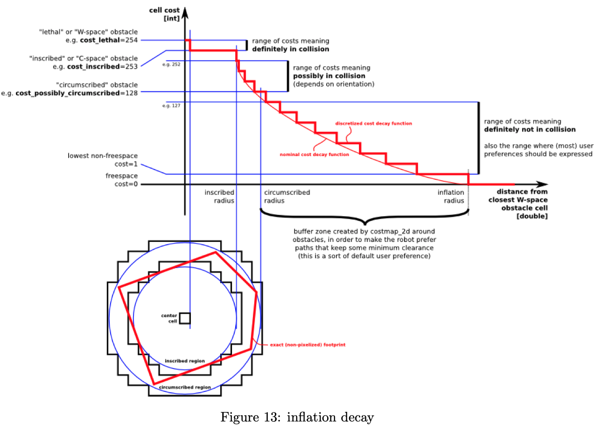

# move-base


[导航调参指导](https://wiki.ros.org/navigation/Tutorials/Navigation%20Tuning%20Guide)
- 1检测机器人是否具备导航功能？
  - Range Sensors
  - 较高精度的 Odometry
    - 检查旋转
    - 检查平移
  - Localization
- 2代价地图
  - expected_update_rate
  - transform_tolerance
  - map_update_rate
  - publish_frequency
  - 用 voxel_grid 或 costmap ？
  - *Rviz* is a great way to verify that the costmap is working correctly.
- 3局部规划器
  - > On robots that have reasonable acceleration limits, I typically use the dwa_local_planner, on those that have lower acceleration limits and would benefit from a rollout that takes acceleration limits into account at every step, I'll use the base_local_planner .


[机器人导航配置文档总结](https://wiki.ros.org/navigation/Tutorials/RobotSetup)
- 1机器人配置
  - 安装 ROS
  - TF 配置
    - 根据 URDF？
  - 传感器
    - 数据类型 `sensor_msgs/LaserScan` 或 `sensor_msgs/PointCloud`
  - 里程计
    - tf
      - Manage the relationships between **coordinate frames** relevant to the robot in a transform **tree**
      - 维护坐标系间的相对变换关系，不包含速度、协方差矩阵
    - `nav_msgs/Odometry`
      - 描述某个坐标系（一般是`base_link`）的信息
      - `Header` header
      - `string` **child_frame_id**
      - `geometry_msgs/PoseWithCovariance` pose
      - `geometry_msgs/TwistWithCovariance` twist
  - 底盘控制器
    - 订阅`cmd_vel`消息
      - (vx, vy, vtheta) <==> (cmd_vel.linear.x, cmd_vel.linear.y, cmd_vel.angular.z)
  - `map_server`
- 2导航功能配置
  - 2.1创建一个ROS包
  - 2.2创建配置机器人的launch文件
  ```
  <launch>
    <node pkg="sensor_node_pkg" type="sensor_node_type" name="sensor_node_name" output="screen">
      <param name="sensor_param" value="param_value" />
    </node>

    <node pkg="odom_node_pkg" type="odom_node_type" name="odom_node" output="screen">
      <param name="odom_param" value="param_value" />
    </node>

    <node pkg="transform_configuration_pkg" type="transform_configuration_type" name="transform_configuration_name" output="screen">
      <param name="transform_configuration_param" value="param_value" />
    </node>
  </launch>
  ```
  - 2.3配置全局/局部的代价地图Costmap
    - ROS包`costmap_2d`
    - global_costmap
    - local_costmap
      - 用于局部规划
      - 用于动态避障
    - **代价地图的参数配置**
      - 公共参数配置：`costmap_common_params.yaml`
        - `obstacle_range`：障碍物感知的最大范围，只更新范围内的costmap
        - `raytrace`：根据传感器消息清除范围内的障碍物
        - `footprint`：机器人轮廓
          - 假设机器人中心坐标为(0.0, 0.0)
        - `inflation_radius`：
        - `observation_sources`
          - laser_scan_sensor: {sensor_frame: frame_name, data_type: LaserScan, topic: topic_name, marking: true, clearing: true}
          - point_cloud_sensor: {sensor_frame: frame_name, data_type: PointCloud, topic: topic_name, marking: true, clearing: true}
      - 全局代价地图配置：`global_costmap_params.yaml`
        - global_frame: /map
          - 所属坐标系
        - robot_base_frame: base_link
          - 底盘坐标系
        - update_frequency: 5.0
        - static_map: true
      - 局部代价地图配置：`local_costmap_params.yaml`
        - global_frame: **odom**
          - 所属坐标系
        - robot_base_frame: base_link
          - 底盘坐标系
        - update_frequency: 5.0
        - publish_frequency: 2.0
        - static_map: false
        - rolling_window: true
          - 保存以机器人为中心的代价地图
        - width: 6.0
        - height: 6.0
        - resolution: 0.05
          - 常与静态地图的分辨率一致，每个cell的尺寸
      - 参考[**costmap_2d**](https://wiki.ros.org/costmap_2d)
  - 2.4配置局部规划（仅仅以 base_local_planner 为例）：base_local_planner_params.yaml
    - max_vel_x: 0.45
    - min_vel_x: 0.1
    - max_vel_theta: 1.0
    - min_in_place_vel_theta: 0.4
    - acc_lim_theta: 3.2
    - acc_lim_x: 2.5
    - acc_lim_y: 2.5
    - holonomic_robot: true
  - 2.5生成导航的launch文件
  ```
  <launch>
    <master auto="start"/>
  <!-- Run the map server -->
    <node name="map_server" pkg="map_server" type="map_server" args="$(find my_map_package)/my_map.pgm my_map_resolution"/>
  <!--- Run AMCL -->
    <include file="$(find amcl)/examples/amcl_omni.launch" />

    <node pkg="move_base" type="move_base" respawn="false" name="move_base" output="screen">
      <rosparam file="$(find my_robot_name_2dnav)/costmap_common_params.yaml" command="load" ns="global_costmap" />
      <rosparam file="$(find my_robot_name_2dnav)/costmap_common_params.yaml" command="load" ns="local_costmap" />
      <rosparam file="$(find my_robot_name_2dnav)/local_costmap_params.yaml" command="load" />
      <rosparam file="$(find my_robot_name_2dnav)/global_costmap_params.yaml" command="load" />
      <rosparam file="$(find my_robot_name_2dnav)/base_local_planner_params.yaml" command="load" />
    </node>
  </launch>
  ```

[RVIZ 可视化调试](https://wiki.ros.org/navigation/Tutorials/Using%20rviz%20with%20the%20Navigation%20Stack)

可视化组件：
- 2D Nav Goal
  - Topic: move_base_simple/goal
  - Type: geometry_msgs/PoseStamped
- 2D Pose Estimate
- Static Map
- Particle Cloud
- Robot Footprint
  - Topic: local_costmap/robot_footprint
  - Type: geometry_msgs/PolygonStamped
- Obstacles
  - Topic: local_costmap/obstacles
  - Type: nav_msgs/GridCells
- Inflated Obstacles
  - Topic: local_costmap/inflated_obstacles
  - Type: nav_msgs/GridCells
- Unknown Space
- Global Plan
  - Topic: TrajectoryPlannerROS/global_plan
  - Type: nav_msgs/Path
  - 只显示全局路径中被局部规划器跟踪的部分
- Local Plan
  - Topic: TrajectoryPlannerROS/local_plan
  - Type: nav_msgs/Path
  - 显示轨迹（包含速度指令）
- Planner Plan
  - Topic: NavfnROS/plan
  - Type: nav_msgs/Path
  - 显示全局路径的全部
- Current Goal

[发布里程计消息](https://wiki.ros.org/navigation/Tutorials/RobotSetup/Odom)
- tf：涉及两个坐标系
- nav_msgs/Odometry：只含一个坐标系的信息

```c++
...
ros::NodeHandle n;
ros::Publisher odom_pub = n.advertise<nav_msgs::Odometry>("odom", 50);
tf::TransformBroadcaster odom_broadcaster;
...
//first, we'll publish the transform over tf
geometry_msgs::TransformStamped odom_trans;
odom_trans.header.stamp = current_time;
odom_trans.header.frame_id = "odom";
odom_trans.child_frame_id = "base_link";

odom_trans.transform.translation.x = x;
odom_trans.transform.translation.y = y;
odom_trans.transform.translation.z = 0.0;
odom_trans.transform.rotation = odom_quat;

//send the transform
odom_broadcaster.sendTransform(odom_trans);

//next, we'll publish the odometry message over ROS
nav_msgs::Odometry odom;
odom.header.stamp = current_time;
odom.header.frame_id = "odom";

//set the position
odom.pose.pose.position.x = x;
odom.pose.pose.position.y = y;
odom.pose.pose.position.z = 0.0;
odom.pose.pose.orientation = odom_quat;

//set the velocity
odom.child_frame_id = "base_link";
odom.twist.twist.linear.x = vx;
odom.twist.twist.linear.y = vy;
odom.twist.twist.angular.z = vth;

//publish the message
odom_pub.publish(odom);
...
```

[发布传感器数据流](https://wiki.ros.org/navigation/Tutorials/RobotSetup/Sensors)

导航目前只接收两种消息类型

- ROS消息的 `Header`
```
#Standard metadata for higher-level flow data types
#sequence ID: consecutively increasing ID
uint32 seq

#Two-integer timestamp that is expressed as:
# * stamp.secs: seconds (stamp_secs) since epoch
# * stamp.nsecs: nanoseconds since stamp_secs
# time-handling sugar is provided by the client library
time stamp

#Frame this data is associated with
# 0: no frame
# 1: global frame
string frame_id
```
- sensor_msgs/LaserScan
```
#
# Laser scans angles are measured counter clockwise, with 0 facing forward
# (along the x-axis) of the device frame
#

Header header
float32 angle_min        # start angle of the scan [rad]
float32 angle_max        # end angle of the scan [rad]
float32 angle_increment  # angular distance between measurements [rad]
float32 time_increment   # time between measurements [seconds]
float32 scan_time        # time between scans [seconds]
float32 range_min        # minimum range value [m]
float32 range_max        # maximum range value [m]
float32[] ranges         # range data [m] (Note: values < range_min or > range_max should be discarded)
float32[] intensities    # intensity data [device-specific units]
```
- sensor_msgs/PointCloud
```
#This message holds a collection of 3d points, plus optional additional information about each point.
#Each Point32 should be interpreted as a 3d point in the frame given in the header

Header header
geometry_msgs/Point32[] points  #Array of 3d points
ChannelFloat32[] channels       #Each channel should have the same number of elements as points array, and the data in each channel should correspond 1:1 with each point
```

[[costmap_2d]]