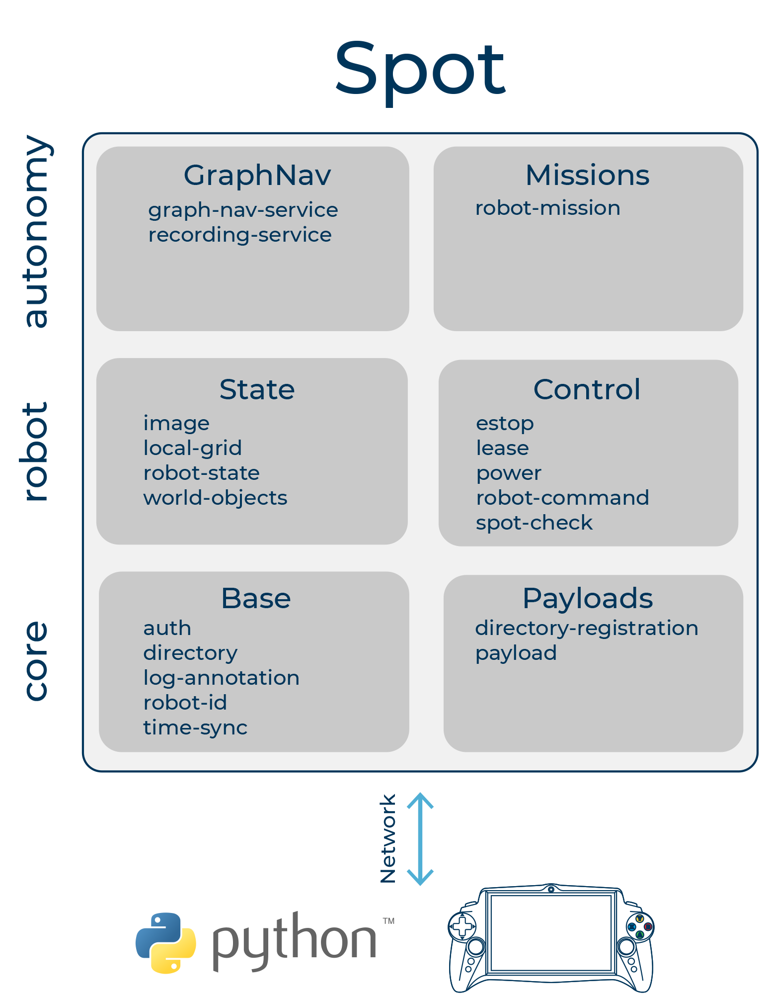

# navigation

- [Maurice Fallon: Navigation Systems with Quadruped robots [ICRA 2020 WS - Legged Robots]](https://www.youtube.com/watch?v=7B1swCwRPik&feature=emb_logo)
- [Building a Legged Robot with ROS (Péter Fankhauser)!!!](https://www.youtube.com/watch?v=5BkoGug8HhE)
- [Péter Fankhauser – Doctoral Thesis Presentation](https://www.youtube.com/watch?v=04aXqKR2HSc&list=PLE-BQwvVGf8F902rN1-uTxrWYqU1oWGIr&index=2&t=0s)
  - Navigation 导航功能
    1. Laser Range Data
    2. Localization
    3. **Elevation Mapping**
    4. Traversability Est.
    5. Navigation Planning
    6. Exection

- [The Open Motion Planning Library](https://ompl.kavrakilab.org/index.html)
  - ompl::geometric::RRTstar
- GraspIt!
- MoveIt!
- OpenRave



- [pointcloud_to_laserscan](http://wiki.ros.org/pointcloud_to_laserscan)
  - > Converts a 3D Point Cloud into a **2D laser scan**


**BUG (2020-7-15)**
```c++
//compute odometry in a typical way given the velocities of the robot
double dt = (current_time - last_time).toSec();
double delta_x = (vx * cos(th) - vy * sin(th)) * dt;
double delta_y = (vx * sin(th) + vy * cos(th)) * dt;
double delta_th = vth * dt;

x += delta_x;
y += delta_y;
th += delta_th;
```
**速度是相对于当前机身的速度，而非相对于 odom 坐标系!**